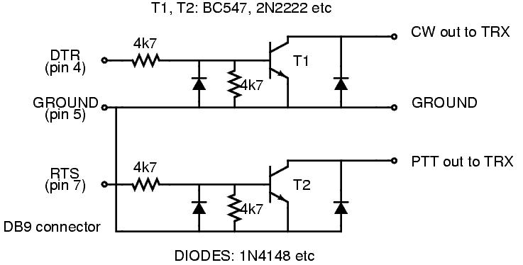

= TLF-0.9.9
(C) 2001, 2002, 2003 - Rein Couperus, PA0RCT

_TLF_ is a free console mode general purpose CW keyer, voice keyer,
logging and contest program for hamradio under LINUX.

_This program is published under GPL_ +

[align="center"]

[width="100%",cols="50%,50%",]
|=====================================================
a|
Content
-------

link:#Description[Program description] +
link:#Why[Why TLF?] +
link:#Features[Features] +
link:#Installation[Installation] +
link:#Prepare[Preparations before running TLF] 

* link:#Files[Files] 

link:#Operation[Operation]

* link:#CT[CT compatibility]
* link:#logging[Loggging qso's]
* link:#deleting[Deleting qso's]
* link:#editing[Editing previous qso]
* link:#rst[Changing RST]
* link:#mode[Changing mode]
* link:#band[Changing bands]
* link:#contest[Contest commands]
* link:#keyer[Keyer commands]
* link:#radio[Radio control]
* link:#log[Log commands]
* link:#time[Changing time and zone]
* link:#score[Score window]
* link:#message[Setting up messages]
* link:#dupe[Dupe check]
* link:#partials[check partials / auto_complete]
* link:#propagation[Checking propagation]
* link:#cluster[DX cluster connection]
* link:#lan[IP Networking for M/S and M/M operation]
* link:#paras[Editing the .paras file]
* link:#simulator[CW contest simulator]

link:#Commands[TLF Commands] +
link:#Options[TLF options] +
link:#Logcfg[logcfg.dat] +
link:#Other[Program your own contest...]

^.^|
|=====================================================

[[Description]]
Description
-----------

*TLF-0.9.9* is a console (ncurses) mode general purpose CW keyer,
-logging and -contestprogram for hamradio. It supports the **CQWW**, the
**WPX**, the *ARRL-DX* , the **ARRL-FD**,the *PACC* and the *EU SPRINT*
contests (single operator)as well as a lot more basic contests, *general
QSO* and *DXpedition* mode. It interfaces with a **morse code
generator**, a number of **radios**, and with a **DX Cluster**. Tlf can
project cluster data into the excellent *Xplanet* program, written by
**Hari Nair**. +
Contest operation mimics the popular *TR-Log* program for DOS, the
output file is TR- as well as *CABRILLO* compatible. The program was
written for console mode on purpose, to make it run also on smaller
machines, or remotely via a modem link. TLF is developed under **SuSE
9.0**, and tested under *SuSE 8.0, kernel version 2.4.1. Beta testers
welcome !!!* +

There is now also a two-floppy version in development called
**debianham**. That version is maintained by the Debian community, and
contains a Linux mini-distribution and a copy of tlf (version 0.8.19). +

The **cwdaemon-0.7 is fully supported**, featuring *direct mode* for
the keyboard and output to parallel and serial ports and speed and
weight control from the keyboard. +
Two more keyer modules are supported. The cwkeyer from Ivo, 9A3TY with
output on either *ttyS0* or **ttyS1**,and the (more flexible) cwkeyer
for the parallel port from Eric, PA3FKN with output on **LP0**. They
both work with a cw output device called **/dev/cwkeyer**,and can be
fully controlled by TLF. +

As the *cwdaemon* is now more flexible than the other modules, and
easier to maintain (it runs in user mode rather than as a kernel module)
focus of the development is on the cwdaemon. +

**Tlf works with Hamlib-1.1.4.**, you find it at Sourceforge.com.

Tlf provides **full ip networking between tlf nodes**,
syncing/distributing log, packet data, frequency data,local talk, serial
numbers, time sync etc...

link:#content[*Back to contents*]

[[Why]]
Why TLF
-------

I have been using mostly TR-Log for contesting, or CT when working as
guest op in M/S operations. I am especially fond of TR-Log. **When you
have a DOS computer, you don't need TLF. You should use
TR-log.** However, I have now removed all WINDOWS and DOS software from
my computers and put *LINUX* on. This means I can't use my favourite
contesting software anymore (yes, I have also experimented with DOSEMU,
but without great success...) +
 +
*TLF* started as a simple keyboard interface to *cwkeyer-0.1* from
9A3TY. When the WPX 2001 was 2 months away I had to try to write my own
program. That turned out to be great fun. The result of this is
TLF, which very much represents my idea of what a CW contest program
should do. +
 +
Some have asked what the name stands for. The old hands from the days
when CW was still hand-crafted will certainly know. It means **_Try Left
Foot_**. +
On special request TLF will now also log SSB and DIGIMODE qso's. +
 +
link:#content[*Back to contents*]

[[Features]]
Features
--------

*Permanent information displays:* 

[width="100%",cols="50%,50%",]
|=====================================
a|
* Keyer output,
* last 5 log lines,
* UTC time,
* keyer speed, delay,
* keyer status

a|
* (Keyboard\|CQ\|S&P\|Auto),
* DX database output for active call,
* or WWV data if available via packet.

|=====================================

*Optional information windows:*

[width="100%",cols="50%,50%",]
|=======================================================================
a|
* *Dupe* check,
* **score**,
* raw *cluster* output \| DX spots only \| Band Map,
* *Check partial call* with a database of some 28.000 known contest
calls,
* *Zones* worked,
* *Countries* worked

a|
* *Propagation diagrams* based on:
** sun spots,
** **qrb**,
** B>sunup,
** **sundown**,
+
qtr, etc.

|=======================================================================

*Keyer:*

[width="100%",cols="50%,50%",]
|================================================
| |
|================================================

* 6 - 60 wpm,
* 24 CW messages programmable online (you will not remember more
anyway..)
* Auto-CQ with adjustable delay
* Output to the TX on */dev/ttyS0* or */dev/ttyS1* or */dev/lp0* or
*/dev/lp1* via the networked cwdaemon-0.7
* Sidetone is adjustable (and optional).
* Weight adjustable
* Band info output on *lp0*

*Database:* +

image:images/db.png[image] +
Uses standard cty.dat. +

*Interfaces:* +
 +
*TLF* interfaces to the keyers through ip networking **(cwdaemon)**,
Both for output on the parallel port and the serial port. +
Interface to the radios has been kept modular, since tlf-0.7.0 the
hamlib library is supported, which enables control of various popular
rigs.

Tlf is now fully link:#lan[*networked*], with an extremely simple setup
procedure... You have to see it to believe it..!

*HW Interface to the trx: Parallel port circuit*
~~~~~~~~~~~~~~~~~~~~~~~~~~~~~~~~~~~~~~~~~~~~~~~~

image:images/parallelport_circuit.jpg[image]

*HW Interface to the trx: Serial port circuit*
~~~~~~~~~~~~~~~~~~~~~~~~~~~~~~~~~~~~~~~~~~~~~~

link:#content[*Back to contents*]

[[Installation]]
Installation
------------

_Install the CW driver_
~~~~~~~~~~~~~~~~~~~~~~~

Download cwdemon-0.7.tar.gz and untar it. +
 +
To install the daemon, do (as root): +

-----
1: ./configure
2: make
3: make install
-----
 
The program is installed in /usr/sbin, and can be started (as root) with
cwdaemon (or cwdaemon -n). +
 +
The default output port is /dev/lp0. Be sure to unload the lp module
first (rmmod lp).See the provided README for more details. +
The manual page will tell you some more about startup options, you could
also type cwdaemon -h.

*Testing cwdaemon* +
Install the netcat package and type: 'nc -u localhost 6789'. +
Any character typed on the command line will be sent to cwdaemon after
you hit enter. You could also use the following shell script which is
character based:

-------------------------------------------
*******************************************
#!/bin/sh

old_tty_settings=$(stty -g)
stty -icanon
trap 'stty "$old_tty_settings"; exit 0' INT

echo "Press (CTRL-C) to interrupt..."

while true; do
Keypress=$(head -c1)
echo $Keypress | nc -q0 -u localhost 6789
done
*******************************************
-------------------------------------------

This only works if your version of netcat supports the -q switch. If you
don't have it, you also could try: +
'echo $Keypress > /dev/udp/localhost/6789'

_Install the Hamlib library_
~~~~~~~~~~~~~~~~~~~~~~~~~~~~

- Get the Hamlib 1.1.4 library +
- Unzip and untar the archive +
- Go into the top directory +
- As **root**, do ./configure, make, and make install. +
- Add /usr/local/lib to /etc/ld.so.conf and run ldconfig (as root).

_Install the TLF program_
~~~~~~~~~~~~~~~~~~~~~~~~~

Get the latest distribution of tlf from the download site
(http://savannah.nongnu.org/download/tlf). +
Tlf now supports GNU autoconf and automake, which automates the
installation process, and makes sure you haveall the goodies on your
machine which tlf needs.. +
 +
You have to be root to install tlf. +
* Read ./doc/README and INSTALL +
* Untar the archive (e.g. tar zxvf tlf-0.9.9.tar.gz) +
* cd into the top directory (cd tlf-0.9.9) +
* type ./configure (if you want to use hamlib, type ./configure
--enable-hamlib, install hamlib first...) +
* type make +
* type make install

*Directory structure*

It is good practise to use separate directories for the different
contests. +
TLF can be started from any directory. to start a specific contest you
need to:

* mkdir _contestname_
* *copy a logcfg.dat file into it*
* edit the *logcfg.dat* file (call, logfile,) to suit your needs
* edit the *rules file* for the relevant contest ( mults, points)
* **start tlf with _tlf_**. Normally startup messages are suppressed to
enable a quick restart of the program.
* If you start tlf for the first time in a directory you will get
messages from the services which are started. If you want that later on
(for debugging purposes) start tlf with **_tlf -v_**.
* If you want to know which version you are running start with **_tlf
-V_**.
* If you want help, start tlf with tlf -h

====
Example:

E.g. For the cqww2003ssb I made the following structure:

~/tlf/contest/cqww2003ssb/ (the working directory tlf is started
from...)

~/tlf/contest/cqww2003ssb/logcfg.dat

~/tlf/contest/cqww2003ssb/cqww2003ssb.log

~/tlf/contest/cqww2003ssb/rules/cqww
====

The general commands to configure tlf are in logcfg.dat; the contest
specific parameters are in ./rules/cqww.

There are examples in the /usr/local/share/tlf and
/usr/local/share/tlf/rules directories. You can use these as templates
and edit your call etc...

With tlf-0.9.9 it is now possible to start tlf with different logcfg.dat
files for each operator. If you sgtart tlf e.g. With tlf -fPA0R you get
the logcfg.dat file for PA0R.

The cty.dat and mastercalls file sit in /usr/local/share/tlf, and they
are read from there. You may want to add information to them before the
contest. Leave them in place so tlf can find them !! You normally need
root privileges for editing in /usr/local/share... +
The cty.dat file included in the distribution of tlf-0.9.9 is the one
from October 2003. +
 +
link:#content[*Back to contents*] +

[[Prepare]]
Preparation
-----------

Make sure the cwdaemon runs (start as root)before starting tlf if you want to use the keyer or the voice keyer....

1.  Start the program (**tlf**).

image:images/prstart.png[image]

*FILES*
~~~~~~~

[cols=",",]
|=======================================================================
| *./clfile* a|
This is the input FIFO for the DX cluster monitor. You only need it when
you use a dx cluster, or any other information you want the program to
display, and if you cannot use ttyS0 or ttyS1 (e.g. you have only 1
serial port, which is used for rig ctrl). +
There are several ways to get the cluster data into it. +
You can use the *"call"* ax25 tool. . +
You can get the info into clfile by starting call with:

-------------------------------
call -r packetinterface \| tee 
tlfworkingdirectory/clfile
-------------------------------

You can also use telnet. Open a new terminal in the working directory,
and start telnet with: 

------------------------------
telnet node \| tee -a clfile
------------------------------

*TLF* will pick it up from there (it will look in the working directory
for clfile!!). +
 +
**TLF now also has its own comfortable telnet client and tnc terminal
!!**You have to set the proper parameters for this in the logcfg.dat
file. +
 

**Note:**When your tlf node wants to receive packet date via the LAN,
from another tlf node, the FIFO must also be active.... For this purpose
you must set FIFO_INTERFACE in the logcfg.dat file!

|*cty.dat* |This is the DXCC database. It resides in
/usr/local/share/tlf.

|*mastercalls* |This is the contest calls database. It resides in
/usr/local/share/tlf.

|*./.paras* |The parameter file. It remembers some parameters for
the next session. TLF will generate one for you. It is not necessary to
touch this, as all parameters are included in the file logcfg.dat, which
can be edited within tlf.

|*./logcfg.dat*

or *other_logcfg_file*

(start with _tlf -fother_log_file_)

|The configuration file. It enables you to configure tlf for a specific
operator,for normal qso operation, etc. A template is available in
/usr/local/share/tlf. You should stick to the format as much as
possible. In case certain parameters are mutually exclusive, the last
one wins. +
As more functions become available in future, new versions of logcfg.dat
will become available. Lines starting with '#' are ignored. If there is
no logcfg.dat file in the working directory tlf will try to read the one
from /usr/local/share/tlf. Be sure to edit your call and the log file
name.

|*./rules/contestname* |The rules file. It enables you to configure
tlf for a specific contest, for normal qso operation, etc. A template is
available in /usr/local/share/tlf/rules. You should stick to the format
as much as possible. In case certain parameters are mutually exclusive,
the last one wins.... +
As more functions become available in future, new rules templates will
become available. Lines starting with '#' are ignored. If there is no
./rules/contestname file in the working directory tlf will try to read
the one from /usr/local/share/tlf/rules.

|*xxxxxxxxxxxxxxx.log* |The log file. You name it!

|*./cabrillo* |This file will be generated by the ":write" command
after the contest. Rename to YOURCALL.CBR and email....

|*./logname.adif* |This file will be generated by the ":adif"
command after the contest. This file format can be used to post the log
to LOTW or import in other loggers.
|=======================================================================

 
link:#content[*Back to contents*]

[[Operation]]
Operation
---------

[black yellow-background]#For the latest commands, keys and parameters for logcfg.dat and rules
please read the README and the MAN-PAGE (man tlf), which are up to
date...#

*CT compatibility mode*
~~~~~~~~~~~~~~~~~~~~~~~

CT compatibility has been added to tlf in order to make it easier for
those who have been workingwith CT a lot as guest operators during M/S
or M/M operations. +
Two things have been added to tlf to accomplish this:

* CT compatible synonyms for those commands used most often in CT
* Use of the ENTER, INSERT and + keys for logging qso's

The CT compatible commands are active all the time, they are just
aliases for existing tlf commands. +
 +
By setting the *CTCOMPATIBLE* parameter in logcfg.dat logging in tlf
will behave like CT instaead of TR.This means that:

* ENTER will log the qso
* Insert will send message F2 (to be programmed as @ 5NN 'yourzone')
* "+" will send F3 (QRZ message, e.g. TU 'yourcall') and log the qso,
instead of toggling between CQ mode and S&P mode (there is no S&P mode
in CT).

The log file of tlf is TR compatible, also in CT compatibility mode.

link:#content[*Back to contents*]

*Logging qso's*
~~~~~~~~~~~~~~~

All activity takes place in the call input field (and the exchange input
field..). +
When you enter (part of) a call, several things happen:

* If check partials is on, and link:#partials[auto_complete] is active,
the call will be automatically completed. E.g. when youtype PA0RC, it
will automatically complete to PA0RCT. The same for KC1X?, W3LP? etc....
* *Backspace* will remove character from the end of the call
* *ESCAPE* will remove the call completely, and also erase the exchange
field
* *left_arrow* will allow you to edit the call in the input field
(**enter edit mode**)
* Call edit now uses Insert mode as default.
* In edit mode, ctrl-A will jump to the beginning of the call, ctrl-E to
the end.
* In edit mode, Backspace removes the character before the cursor,
Delete deletes the charactor under the cursor.
* If after a Delete or an Insert you leave edit mode with TAB, the
auto_complete function is switched off for the running qso. This enables
you to change a call when it is locked by link:#partials[auto_complete]
because it is a unique call in the database
* If after a Delete or an Insert you leave edit mode with ESCAPE or
ENTER, auto_complete is not switched off.
* If the check window is on, it will show the last qso's in the log (on
the contest bands)
* The bottom status line will show country and qrb info, as well as the
local time of the station..
* When you press *Ctrl-p* you will get a screen with the *muf* curve
based on the number of sunspots,the distance, bearing , sunset, sundown
etc. Any key will get you back to where you came from.
* You can go to the *exchange field* with SPACE or TAB or **ENTER**.
* For the arrl_ss contest the exchange input is intelligent, incl. call
update in the exchange field.E.g. in SS you can enter 23A 98OH and tlf
knows what you mean.
* *ENTER* will log the qso in SSB mode, and also if you are in CW and
qso (non-contest) mode.
* In case you want to log a cw qso during a contest *without cw* output,
you can use *"\"* (backslash).

link:#content[*Back to contents*]

QSO B4 message
~~~~~~~~~~~~~~

Tlf will automatically generate an qso b4 message in case you try to
work a dupe. This message is taken from message F7. If you want to work
the dupes anyway set *NOB4* in logcfg.dat !! +
 +
link:#content[*Back to contents*]

Deleting qso's
~~~~~~~~~~~~~~

Using the *"-"* key will delete the last qso from the log (after asking
your permission of course).

Editing the 5 previous qso's
~~~~~~~~~~~~~~~~~~~~~~~~~~~~

You can edit the 5 previous qso's with **"Up-arrow"**. This qso editor
is using overwrite mode. Use the cursor keys tonavigate, and leave edit
mode with enter, tab or escape. +
You can use Insert and Delete. If you use "up-arrow" in the first line
you go into *LOG VIEW* mode. +
During edit mode LAN messages are kept in a buffer. You can edit
anywhere in the log with the *:edit* command.

Edited qso's are NOT sent to other nodes in the network. But you can
sync the logs with another node with the *:SYNC* command.

.

link:#content[*Back to contents*]

'''''

*Changing RST*
~~~~~~~~~~~~~~

You can change *RST sent* when a Call is in the **Call Input Field**.
*Page_down* will lower the S value and *Page_up* will increase it. +
 +
*RST received* can be changed by going into the *exchange field* and
using Page_down and Page_up accordingly.

. +

link:#content[*Back to contents*]

'''''

*Changing CW/SSB mode*
~~~~~~~~~~~~~~~~~~~~~~

The commands are *:MODe, :CWMode, :SSBmode* and *:DIGimode* .

'''''

*Changing Bands*
~~~~~~~~~~~~~~~~

When you are in the call input field, use the *left_arrow* and
*right_arrow* keys to change the band, also with the Trlog commands
*Alt-v* and **Alt-b**. You can switch off the arow keys by entering
NO_BANDSWITCH_ARROWKEYS in the logcfg.dat file. +
When contest mode is on, only the contest bands can be reached
(160-80-40-20-15-10).

image:images/bands.png[image] +

For the *WARC bands* set CONTEST=qso and uncomment CONTEST_MODE in
logcfg.dat +
 +
If a radio interface is present, band switching can be done in several
ways:

* Switch bands on the radio - tlf will follow
* Switch bands on tlf - the radio will follow
* Enter a frequency in tlf - the radio will jump to that qrg
* Pick a frequency from bandmap or spot list - the radio will go there
* If you have a frequency int the MEMory, press # - the radio will go
there

link:#content[*Back to contents*]

'''''

*Contest commands*
~~~~~~~~~~~~~~~~~~

Some special commands are needed for use in a contest:

* Switch between *Run* mode and *S&P* mode: **+**(CT mode has no S&P)
* Confirm last *serial* nr: *"_" (underscore)*
* Confirm last **call**: *"="*
* Show list of *zones* yet to be worked: *":zones"*
* Show list of *countries* left over: *":cty"*
* Show **propagation**: *"ctrl-p"*
* Switch to **keyboard**: *","* or *"ctrl-k"*

link:#content[*Back to contents*]

'''''

*Keyer commands*
~~~~~~~~~~~~~~~~

* Change the *speed* with *Pg-up* or **Pg-down**. You can see the speed
in the upper status line (S=45)
* Change the *weight* with **Alt-w**, Values from -5 to +5, ENTER.
* Change the *auto_cq delay* with Ctl-**page-up** and Ctl-**page-down**.
This only works if the call input field is empty. If it is not, you will
change the RST value. Set it to the **total length of the message + the
receive time.**! On some terminals the Ctrl-Pgup and Ctrl-Pgdown keys
don't work. You can also use the *:CQDelay* command. You can see the
value in te upper status line (D=11)
* Start the *auto_cq* with **F12**. Or if contest mode is on, and input
field is empty, with ENTER.
* Switch to **keyboard**: *","* or *"ctrl-k"* The above commands also
work when the keyboard is on.
* Change the sidetone frequency with **":tone"**. A value of 0 will
switch sidetone off.

link:#content[*Back to contents*]

'''''

*Radio control commands*
~~~~~~~~~~~~~~~~~~~~~~~~

The rig control works with Hamlib-1.1.4.

The radio interface is switched on with the following commands in
logcfg.dat:

* RADIO_CONTROL #switch the interface on
* RIGPORT=/dev/ttySx or /dev/USBx

* You can use e.g. /dev/ttyS0, /dev/ttyUSB1, etc... anything that looks
like a tty. RPC rig daemon users should have RIGMODEL=1901 and
RIG­PORT=localhost. In this case RIGSPEED is ignored.
* RIGMODEL=351 (Hamlib index number of your rig, this is the OMNI VI
plus )

* RIGSPEED=2400 (1200 - 56k tested )
* RIT_CLEAR (resets rig after qso is logged (only if your radio and
Hamlib support it)
* SHOW_FREQUENCY (shows large frequency display if score window is
off) +
 +

image:images/radio.png[image]

* See your *trx frequency* on the right hand side of the screen just
below the log line. +
E.g. *TRX: 10105.0*
* Tlf will follow the bandswitch of the trx.
* *Fast qsy* by just entering the new qrg into the empty call input
field in kHz (e.g. 3505).
* *Remember your run frequency* by putting it into the memory with
**"#"**. The memory display will pop up and show the frequency you can
return to by again entering **"#"**.
* *Grab a dx spot.* __This only works if you have a radio interface
program for your type of trx running__, and if you are connected to a
cluster and have the *bandmap* or *spot* windowon screen. Just enter
part of the call of the dx station (e.g. 6W when the call is
6W/DJ0LN/P), enter *"ctrl-g"* (for "grab")and you will see the trx
magically qsy to the spot frequency, where you can loose valuable time
in thepileup. :-}
* *Add a spot to the list* by entering a Call into the call field and
pressing Ctrl-A. Thisworks with band map as well as spot list.
* If you set the RIT parameter (**:RIT**), the RIT will be *reset* after
a qso is logged.__This only works if your radio supports the set_rit
function!!!__
*  +

*Ctrl-f* will give you a window in which you can change the TRX
frequency in 100Hz (with up-arrow, down_arrow) or 20 Hz steps (left-arrow,
right-arrow).

A Radio Control Interface is available for a growing number of rigs. +
The development is done by the active Hamlib group. Info about rig
compatibility is available on: +
*http://hamlib.sourceforge.net/*

link:#content[*Back to contents*]

'''''

*Log commands*
~~~~~~~~~~~~~~

* *Look at the log* with **":view"**. It starts a new shell with LESS. +
You can also simply use *up-arrow* to move the cursor upwards...
* *Edit the log* with **":edit"**. It starts a new shell with JOE, VI or
E3. Other editors on request...
* If that is not enough you can start an empty shell with **"!"**, and
*grep* the logfile, *copy* it, etc...

link:#content[*Back to contents*]

'''''

*Change your time zone and location*
~~~~~~~~~~~~~~~~~~~~~~~~~~~~~~~~~~~~

Set parameter TIME_OFFSET in logcfg.dat when your computer clock does
not run on UTC. The parameter can have anyvalue between -23 and 23. +
 +
Edit the cty.dat file, and put the data of your qth into the line
representing your country. An example:

-----------------------------------------------------------------------
United States:            05:  08:  NA:   43.00:    87.90:     5.0:  K:
-----------------------------------------------------------------------

If you are in zone 04, change the 05: into 04:, change the 43.00 and the
87.90 into your location. and the 5.0 (time difference to GMT) at the
end to 6.0 +
 +
This will enable tlf to show the DX time of a station you are working. +
Tlf is picky with respect to the exact format of the file; make sure the
stuff is in the right columns! +
 +
When there is a TIME_MASTER on the **network**, the tlf clock will be
synchronized with the master. +
To designate a station as a time master, just set TIME_MASTER in
logcfg.dat. +

link:#content[*Back to contents*]

'''''

*The score window*
~~~~~~~~~~~~~~~~~~

image:images/bands.png[image] +

The score window is adapted to the contest you are in. So if the contest
parameter is set to cqww, you geta special score window for it, showing
qso's per band, countries worked per band, zones worked per band and
total score. +
It also gives an indication of the qso's per multiplier, and the qso
rate based on the last 10 qso's. +
When you restart the program the score is **recalculated from the log
file**. When a qso is *deleted* from the logfile the score is not
adjusted, neither is the list of counties worked updated. You can
correct this by using the *:REScore* command. With this operation the
points are taken from the log, and the mults are recalculated! Through
deletion of qso's and node down times the logs on separate nodes may
differ after running for considerable time. This is normal, it happens
also with CT and Trlog. Tlf can resync the log of a node on the fly by
setting the SYNCFILE=<user:password@host/dir/logfile> parameter in
logcfg.dat.

By issueing the :SYNC command the local log is merged with the log on
the other node.

It is even possible to start a node mid-contest without a log, :SYNC
will get the log from the master node. +
 +
At the bottom of the window you will see the *QSO's/MULT* display, and
the *RATE* (qso's per hour, based on the last 10 qso's) as soon as tlf
has enough data to calculate it. The RATE display is rather coarse at
the moment., as it is based on the time it took for the last 10
qso's.... +
 +
The format of the display is dependent on the type of multiplier(s). I
may be that for a certain combination of points and mults a display is
not yet available, send your requirements to the mailing list
(tlf-devel@nongnu.org). Well in advance of the contest you need it for
!!

link:#content[*Back to contents*]

'''''

*The Messages*
~~~~~~~~~~~~~~

There are 24 messages. More than I can remember. Some have a special
use:

* F1= *CQ call* (run mode) or *DE CALL* (S&P mode). The "DE" can be
switched on or off (**:demode**)
* F2 = free (normally "@ DE %"
* F3 = runmode *report* (e.g. *@ [ 14).* If *#* is used, the serial nr
can be *SHORT* (TT1)
* F4 = free (normally "73" or "TU")
* F5 = free (normally "@"
* F6 = free (normally "%"
* F7 = free (normally "B4"
* F8 = free e.g. "AGN"
* F9 = free e.g. "?"
* F10 = free e.g. "QRZ?"
* F11 = free e.g. "UR CL?"
* F12 = auto_cq message, e.g. "TEST PA0RCT"
* S&P TU msg = e.g. "TU [14"
* Run TU msg = e.g. "TU %"
* alt-0 to alt-9 can be programmed in the logcfg.dat file

image:images/messages.png[image] +
For the messages you can use a number of special characters:

* % for YOURCALL
* @ for HISCALL
* [ for RST
* # for serial nr.
* - lower keyer speed by 5 wpm (parallel interface only !)
* + increase keyer speed by 5 wpm (e.g. " ++5NN--#") (parallel interface
only)

The easiest way to handle the messages is to edit them in the rules file
for the relevant contest. You can keep separate rules files for
different contests and operating situations. +
You can list the messages with *":list"* and change them with
**":message**"

. +

link:#content[*Back to contents*]

'''''

*Dupe checking*
~~~~~~~~~~~~~~~

image:images/check.png[image] +
 +
With the *":check"* command you can open a pop-up search window which
will tell you:

* On *what bands* you worked the station, and what the *exchange* was
* If the station is a **dupe**, the color will be red and the terminal
will beep.
* On what bands you worked the *country* already
* On what bands you worked the *zone* already
* In case of other **multipliers**, on what bands they were worked.
* If the exchange is the same for every band, it is automatically filled
into the exchange field

link:#content[*Back to contents*]

*Intelligent exchange input check for the ARRL sweepstakes*
~~~~~~~~~~~~~~~~~~~~~~~~~~~~~~~~~~~~~~~~~~~~~~~~~~~~~~~~~~~

In the arrl sweepstakes contest e.g. the exchange is
SERIAL-PRECEDENCE-CHECK-SECTION. +
Tlf enables you to input these items in almost any order, like 12A 87ORG
or ORG 12 87 A.If you set CALLUPDATE in logcfg.dat, the call in the call
input field will be updated also. (needs blanks on bothsides, works for
US/CANADA only...). The lowest line in the check window shows if tlf has
recognized the right ingredients. +
If no section is present in the exchange, tlf will ask for it before
logging the qso. +
This needs some experimenting *before* the contest to get acquainted
with this feature. +

link:#content[*Back to contents*]

'''''

*Check partials / auto_complete*
~~~~~~~~~~~~~~~~~~~~~~~~~~~~~~~~

image:images/partial.png[image] +

The check partials function is controlled via the logcfg.dat file with 3
parameters:

* PARTIALS - switches the check partial function on (max. 9 calls)
* USEPARTIALS - enables the auto_complete function
* MANY_CALLS - shows a large window with up to 50 calls

The check partial calls function uses a database derived from the
master.dta file containingsome 25.000 known contest calls. +
When the USEPARTIALS parameter is on, tlf will complete the call as soon
as it is unique in the database. +
This can of course lead to strange effects, but in my experience there
are far more hits than misses.Sometimes you must edit the call because
it has locked on a unique call.... Try it, and switch it off when you
don't like it. +
Some people find that 9 calls is not enough.... MANY_CALLS will give you
many calls. +

image:images/partials.png[image] +

link:#content[*Back to contents*]

'''''

*Checking propagation*
~~~~~~~~~~~~~~~~~~~~~~

 +

The propagation screen is invoked with **ctrl-p**. +
The calculation actually uses the SSN value which is derived from SFI.
If you are connected to a cluster, the WWV values will automatically be
stored, and the last value used.Clfile is periodically checked for this,
and the value stored in wwvfile. +
Starting with version 0.4.4 it is now possible to include the value of R
or SFI in the logcfg.dat file. +
The value will be picked up within a minute, and will be used for
subsequentcalculations. The calculations are quite simple, but you may
compare it to e.g. minprop 3. and see that it really comes quite close.
This may be enhanced in the future, to influence the multiplier map... +
All timing is related to UTC. +

link:#content[*Back to contents*]

'''''

*DX cluster connection*
~~~~~~~~~~~~~~~~~~~~~~~

From version 0.6.1 onward, tlf has three methods to connect to a DX
Cluster:

* Built-in *Telnet* client with auto-connect
* Built-in terminal for *TNC or MODEM* for ttyS0 or ttyS1 (2400 Bd
fixed)
* FIFO in the working directory to hook up with e.g. ax25 based
connections

You get to the packet terminal with **:pac**. +

image:images/cluster.png[image] +
 
*_Telnet internet connection_* +

To enable the telnet interface set the following commands in
logcfg.dat: +
TELNETHOST=internet address +
TELNETPORT=8000 (most of the time) +
 +
e.g. the following lines to connect to **44.137.24.19 port 8000**:

[width="100%",cols="100%",]
|============================
|#TELNETHOST=217.126.142.43 +
#TELNETHOST=44.137.24.103 +
TELNETHOST=44.137.24.19 +
# +
TELNETPORT=8000 +
#TELNETPORT=23
|============================

*_TNC or Modem connection_* +

To enable the serial terminal interface set the following command in
logcfg.dat:

[width="100%",cols="100%",]
|======================================
|TNCPORT=/dev/ttySx or /dev/USBx +
TNC_SPEED=2400 (the default is 2400 Bd)
|======================================

This will open a tty for packet at 2400 Bd +
 +
*_Terminal operation_* +
 +
The terminal commands are:

* :ENTER (in tlf) = goto terminal
* : (in terminal ) = goto tlf
* pg-up = goto view mode
* up-arrow, down-arrow = scroll in view mode
* ENTER = goto edit mode

*_FIFO connection via the file system_* +
 +
To enable the filesystem interface set the following command in
logcfg.dat:

[width="100%",cols="100%",]
|==============
|FIFO_INTERFACE
|==============

Tlf then regularly looks into a fifo called **"clfile" in its working
directory**. It is your responsibility to get the info into it. Some
examples:

* Goto the working directory and start a *telnet session* in a new
terminal.
* start this session with *telnet _node_ | tee -a clfile*
* Connect to the dxcluster, e.g. using *call* with
+
------------------------------
call -r interface | tee clfile
------------------------------
* For filtering, bandmap etc to work, the lines have to start with: "DX
de", Escape characters at the start of the linehave to be filtered out
(e.g. by using "|cut -c 7-97"

As the FIFO_INTERFACE overrules the other ways of connecting, be sure to
switch it off when using the tty or the telenet client!!

*Relevant commands:*

* *:cluster* - full cluster content (filter with ":fil")
* *:spots* - only DX spots in order of time
* *:map or "." (dot)* - only spots for this band, sorted in frequency
* *:ENTER* - Go to the packet terminal
* *Ctrl-B* - *Send msg* to the terminal (on node connected to cluster
through terminal only)
* *Ctrl-A* - *add* your own spot to the list (if radio interface is not
present the freq can be input manually) +
*if the LAN is active the spot will be sent to all nodes*
* *Ctrl-G* - *grab* the spot: type a partial call from the spot or map
window into the call field first.
* *:FILter* - the filter has 4 functions: 0=none, 1=garbage out,
2=announcements out, 3=spots only

* Enter the bandmap with *:map* or *"." (dot)*
* When you are in the bandmap the name changes to BANDMAP
* Use "." to change to NEEDED (only countries you still need to work)
* Use *pg-up, pg-dwn, up, down* to scroll the map
* A "+" sign appears if there is an offset from start of list
* Leave the bandmap with ESCAPE
* Outside the bandmap you can **G**rab a spot by entering a few
characters into the call input fieldand typing **ctrl-g**. +
The full call will appear in the input field, and the trx will go to the
spot frequency (only iftrxcontrol is working).

[width="100%",cols="50%,50%",]
|====================================================================
| |Spots younger than 10 minutes are marked!! +
Double spots are sorted out...
|====================================================================

[width="100%",cols="50%,50%",]
|=======================================================================
|image:images/bandmap.png[image] |The bandmap sorts the frequencies and flags
the ones you don.t need (yellow). +
You can also switch this display to NEEDED, +
so you will see only those countries you still have to work!!
|=======================================================================

[width="100%",cols="50%,50%",]
|=======================================================================
|

|You can use Hari Nair's Xplanet program to show the spots in their
location on the globe.To show azimuthal projection centred on Eersel the
Netherlands you start Xplanet with: +

_xlanetbg -wait 10 -window -geometry 300x300 -markerfile
/home/rein/tlf/test/tlfmarkers +
-projection azimuthal -longitude 5 -latitude 51_ +

(see the xplanet documentation for an explanation). +
set the following line in logcfg.dat:

_MARKERCALLS=tlfmarkers_

to show the calls spotted on the cluster (your directory may vary, here
it is the directory you run tlf from....) +
The display will now update every 10 seconds...
|=======================================================================

link:#content[*Back to contents*]

'''''
[[lan]]
*LAN connection (M/S and M/M operation)*
~~~~~~~~~~~~~~~~~~~~~~~~~~~~~~~~~~~~~~~~

The tlf  network interface uses the udp/ip protocol. It can handle as
many nodes as the network bandwidth supports,but is limited to 8 nodes
at present. (Address space is 64, so recompilation with MAXNODES=64 will
handle 64 nodes).

The udp protocol is used for minimum protocol overhead. Tests with
several tlf nodes have shown that using the tcp protocol does not cure a
network problem, it just adds protocol overhead. The tlf protocol uses
short messages,which will not exceed the limit where fragmentation sets
in. (udp buffer length is 256 bytes). A *:SYNC* command will synchronize
the log on your machine with the log on another specified node if at all
necessary (e.g. If a node has been down for some time, or started up
during the contest).

Each node has 1 receiver on udp port 6788, and sends the data it
generates to the destination nodes.The list of destination nodes is
defined in logcfg.dat of every node.

The message format is very simple: _< THISNODE > < MESSAGE TYPE >
<...data string...>_

THISNODE is a character(A to H) and message type is also a character (1
to 9).

_*TLF network functions*_
^^^^^^^^^^^^^^^^^^^^^^^^^

The following message types presently exist:

1. Log data
2. Packet data from cluster
3. Add spot data to bandmap ("DX de TLF: ...")
4. Frequency data
5. Talk data
6. Present serial number
7. Present utc time

*_Log data_* +
Every tlf node has a copy of the complete log database. This has several
advantages. +
First, having the log at several places in the network reduces the risk
of loosing it... +
Second, it allows using the full power of the log search function
(exchange recall and multiplier search).

*_Packet data_* +
Packet data is available on all nodes, enabling quick spot access. This
also means that only one node needs a packetconnection... 
 
*_Add spot data_* +
Enables local spotting and bandmap preload from any node on the network,
even remotely on the internet... 

*_Frequency data_* +
Every 60 seconds the node broadcasts its operating frequency (if trx
control with Hamlib is used), or theband it is on. This greatly 
simplifies passing mults to a different band !! A display window shows
what qrg the nodes are working...(**:FRE** or **Alt-J**)

[width="100%",cols="50%,50%",]
|=======================================================================
|image:images/freqs.png[image] |Here you see that station A is on 7010 kHz and
Station C (no trx control) is on 20 meters.
|=======================================================================

 
*_Talk data_* +
 +

By just typing [black yellow-background]#*Alt-g* please 2 beers for 
80 meters#,  this message is broadcast to all nodes on the list. 
A display window
shows the last 5 messages received... (with **ctrl-t** or **Alt-g**) +
 +
 +
 +

*_Present serial number_* +
 +
Used when a serial number is used for the exchange (SERIAL_EXCHANGE is
set in logcfg.dat), e.g. in the wpx contest.As soon as a serial number
is sent, it is blocked on the other nodes.... This bridges the time
between sendingthe exchange and actually  logging the qso, mostly
preventing that serial numbers are given out twice!! +
 +
*_Present utc time_* +
 +
When TIME_MASTER is set in logcfg.dat the station broadcasts the actual
utc time to the other nodes. +
When you do this, the other tlf nodes will use this time. The time
receive function has a smoothing filter,so one wrong number will not
kick the node out of sync.

*_Setup for the LAN functions_*
^^^^^^^^^^^^^^^^^^^^^^^^^^^^^^^

To use networking with tlf is not difficult. +
 +
First step is to provide *ip connectivity* between the nodes that you
want to communicate with. It is not important whether you use an
ethernet link, ppp, or whatever.In my shack I use a 10 Mbit coax
ethernet, with a ppp bridge to the house via a 56k modem. This allows
meto remote control the OMNI from the living room... +
For tlf, the word is: "if you can ping it, it will communicate". +
 +
There is one thing to remember: there must be connectivity for port
number 6788. So if there is a firewallbetween two tlf sites, make sure
it passes traffic to port 6788. (Just in case you would want to include
theinternet in your routing...) +
 +
Second step: Provide a *short form unique address* for the node, so tlf
can seewhich node generated the data. For brevity this address is a
character from A...H (for an address spaceof 8 nodes). *If tlf hears
it's own node ID it will ask for another one!!* +
 +
Third: *Edit logcfg.dat* for each node. The only data tlf needs are the
short form address of its node,and the ip addresses (the addresses you
use for the ping) of the nodes it wants to communicate with. +
You can optionally suppress the logging function, e.g. for nodes  which
only provide spots for the bandmap... +
During the communication setup phase it is possible to write a logfile
(debuglog) of all messages the node receives to disk. +
 +

[width="100%",cols="100%",]
|====================
|THISNODE=B +
ADDNODE=192.168.1.2 +
ADDNODE=192.168.1.3 +
# +
# To receive packet information from the network, the FIFO input should be
activated. +
FIFO_INTERFACE
|====================

That's all.... +

switch the debug file on with:

[width="100%",cols="100%",]
|=========
|LAN_DEBUG
|=========

*_Monitoring_*
^^^^^^^^^^^^^^

image:images/info.png[image] +
 +
With *:info* you get a screen showing the node addresses, packets
received, packets sent, and numberof send errors per node. A send error
occurs when a node cannot be reached, e.g. if tlf is not yet running on
it. +
 +
If you set the *LAN_DEBUG* command in logcfg.dat you get a dump called
"debuglog" in your working directory, showing all raw messages received
on this node. It can be very valuable to have 1 node on the LAN
listening to, and recording all messages. It will enable you to restore
the log after a catastrophic failure, or post-analyse cluster messages
etc, etc... +
 +
 +
 +
 +
 +
 +
link:#content[*Back to contents*]

'''''

image:images/sim.png[image]

*Working with the CW simulator*
~~~~~~~~~~~~~~~~~~~~~~~~~~~~~~~

The CW simulator is switched on with **":sim"**. +
Set the contest to CQWW (CONTEST=cqww in logcfg.dat) +
After your CQ with *F1* the run begins. If it stops, call cq again. +
 +
The simulator is meant to work in TRlog mode. It uses the PC speaker for
output. This means you can not switch off the speaker with :TONE in
simulator mode!

link:#content[*Back to contents*]

'''''

*Making a contest qso in CQ Mode (TRlog compatible)* +
 +
1: Press *ENTER* to start the F12 message ("CQ TEST YOURCALL...") or
*F1* +
HC8N: "__HC8N__" +
2: Type HC8N +
3: Press *ENTER* (YOU: "HC8N 5NN14") (message is in **F3**) +
HC8N: "__TUENNAT__" +
4: Press *ENTER* (YOU: "TU YOURCALL") (message in **CQ_MESSAGE**) +
N6TR: "__K7RAT__" +
2: type K7RAT +
3: Press *ENTER* +
etc... +
 +
  +
link:#content[*Back to contents*]

'''''

*Using the keyer* +
the keyer is started with Ctrl-K or with "," (comma). The comma will
only work when the callinput field is empty (and if trxmode is CW of
course. +
The following special cw characters are supported on the serial
interface:

[width="10%",cols="50%,50%",]
|=======
|AR |***
|BT |*=*
|SK |*<*
|KN |*(*
|SN |*!*
|AS |*&*
|BK |*>*
|=======

Stop the sending with **ESCAPE**. +
 +
The cwdaemon features direct mode, so every character ist sent to the
keyer immediately... +

 +

link:#content[*Back to contents*]

'''''

*Making a contest qso in S&P Mode* +
 +
1: find a station to call +
2: Type HC8N to enter the call into the input field +
3: Press *ENTER* (YOU: "YOURCALL") or *F1* +
HC8N: "__YOURCALL ENNAT__" +
4: Press *ENTER* (YOU: "TU 5NN14") (the message is in **SP_MESSAGE**) +
HC8N: "__TU HC8N__" +

link:#content[*Back to contents*]

'''''

*Making a normal qso* +
 +
- Switch contest mode off +
- Use the check window to see if you have worked the stn. before, and +
to remember his/her name :-)) +
- Tab into the exchange field for comments (name, qth) +
- Use ; (notes) for further comments +
- Reprogram the key saying SRI QSO B4 to contain the local WX. +
- Use , (keyboard) to tell your story, nice and slowly... +

link:#content[*Back to contents*]

[[Commands]]
*Command Overview*
~~~~~~~~~~~~~~~~~~

[underline]*_This overview is out of date; for the last version see the tlf manpage
(man tlf) or the internal :HELp command...._*

Most commands start with a **":"**, and you need to type only the
**first 3 characters**.

[width="100%",cols="34%,33%,33%",]
|=======================================================================

|*TR* |*CT* |

|:help |Alt-H |Show online help

|:mode | |switch trx mode (CW, SSB, DIG)

|:CWMode | |switch trx mode (CW)

|:SSB | |switch trx mode (SSB)

|:DIG | |switch trx mode (DIGIMODE)

|:set | a|
list and set parameters. +
 +
the following contests are supported (many more possible):

* CQWW
* WPX
* ARRL-DX (both sides)
* PACC (both sides)
* NRAU
* EU SPRINT
* EU HF Championship
* R1 Field day
* ARRL Field day
* ARRL SS
* Other (wysiwyg mults)
* DX-pedition
* General qso

| |Alt-v |Up-Arrow: Increase CW speed (3wpm)

| | |Down-Arrow: Decrease CW speed (3wpm)

|  |Alt-w |Set weight (-5 ... 5);

|Pg-up | |If call field empty: +
    Increase Auto_CQ delay (1 sec) +
If not empty: +
    increase R**S**T

|Pg-down | |If call field empty: +
    Decrease Auto_CQ delay (1 sec) +
If not empty: +
    decrease R**S**T

|  | | 

|F12 | |Start Auto_CQ

|F1-F11 | |Send CW message

|  | | 

|:tone | |Set sidetone frequency (200-900 Hz) or OFF (0) +
A value between 2 and 20 will add *weight* to the cw elements

|  | | 

|Tab | |Switch between *call input* and *exchange* fields

|+ | |Toggle **CQ**/*S&P* mode

| |+ |Send F3 + log qso

|:SIM | |Toggle *CW simulator* (run) mode (TR only)

|  | | 

|Left-Arrow | |*Change band* if callsign field empty +
(enter edit mode if callsign present, leave edit mode with ENTER or ESC)

|Right-Arrow | |*Change band*

|  | | 

|ENTER | a|
Smart key for contest mode

|\ |ENTER |*log* qso w/o CW;

|; |Alt-N |Insert *note* in log

|, +
ctrl-k |Alt-K |*Keyboard* on. This works only when the call input field
is empty. use ctrl-k if it isn't.

|ESCAPE | a|
Return to call input field

|Ctlr-p | |*Propagation* info

|Ctlr-t |Alt-I |*Last 5 talk messages*

|*"* |Alt-G |*Send talk message to other tlf nodes"*

|- | |*Delete* last qso

|Up-arrow | |*Edit* last qso +
Insert, overwrite, and delete; + log view

|= | |*Confirm* last call

|_ (underscore) | |*Confirm* last exchange

|  | | 

|# | |trx qrg -> mem +
mem -> trx qrg

|ctrl-g | |*Grab* a dx spot

|ctrl-a | |*Add* a dx spot to the spot list or bandmap

|ctrl-b | |*Send* message to cluster

|ctrl-f | |Change TRX frequency with up_arrow, down_arrow (100 Hz at the
time)

|:PACket | |goto packet terminal

|:VIEw |Up-arrow |*View* the log with LESS

|:EDIt | |*Edit* the log with JOE (ctrl-K H = help), vi or e3

|:LISt | |List CW messages

|:MESsage | |Edit CW messages

|:set, :cfg | |edit logcfg.dat configuration file

|:WRIte | |Write Cabrillo file (for selected contests: +
CQWW, WPX, ARRL-DX)

|! | |Get a new shell

|:EXIt |Alt-X, Alt-Q |Exit the program
|=======================================================================

link:#content[*Back to contents*]

[[Options]]
*Options*
~~~~~~~~~

[underline]*_This overview is out of date, for the last version see the 
tlf manpage (man tlf) or the internal :HELp command...._*

[width="100%",cols="34%,33%,33%",]
|=======================================================================
|:mult |Alt-M, Alt-C |Toggle remaining multiplier display

|:contest | |Toggle contest mode on/off

|:check | |dupe check window on

|:nocheck | |dupe check window off

|:score |Alt-S, Alt-R |Toggle score window on/off

|  | | 

|:cluster |Alt-A |Show cluster window or...

|:map |Alt-, |Show Band Map or...

|:spots |Alt-A |Show last 10 spots or...

|:freq |Alt-J |Show frequency or band info...

|:cloff |Alt-A |No cluster info (non-assisted contest operation)

|:info | |network status

|:cty |Alt-M |Show country multipliers per continent

|:zone |Alt-Z |Toggle zones/sections worked display

|:trxcontrol | |toggle trxcontrol on/off (default off, only makes
sense +
with rigcontrol capability)

|:ritclear | |rit reset on/off
|=======================================================================

link:#content[*Back to contents*]

*Logcfg.dat file*
~~~~~~~~~~~~~~~~~

[underline]*_This overview is out of date; for the last version see the tlf manpage
(man tlf) or the internal :HELp command...._*

[width="100%",cols="50%,50%",]
|=======================================================================
|CTCOMPATIBLE |*CT compatible qso logging (default TR)*

|EDITOR=joe +
#EDITOR=vi +
#EDITOR=e3 |choose your favourite editor for :edit and :set

|CALL=PA0RCT |*don't forget to change this one !!*

|#CONTEST=cqww +
#CONTEST=wpx +
#CONTEST=sprint +
#CONTEST=arrldx_usa +
#CONTEST=arrldx_dx +
#CONTEST=arrl_fd +
#CONTEST=arrl_ss +
#CONTEST=pacc_pa +
CONTEST=dxped +
#CONTEST=qso +
#CONTEST=any (you name it) # +
#CQWW_M2 |CQWW_M2 is set **together**with CONTEST=cqww if you are
working in the M2 category. This sets the station info into the cabrillo
file (stn1 or stn 0). +
 +
Use CONTEST=qso for general log use.

|LOGFILE=dxped.log |*don't forget to change this one !!*

|TIME_OFFSET=-1 |*time offset to utc in hours if your system clock does
not run on utc.*

|#LPT1 +
#COM1 +
NETKEYER +
NETKEYERPORT=6789 +
NETKEYERHOST=127.0.0.1 |PA3FKN keyer (not preferred) +
Serial port keyer from 9A3TY not preferred) +
cwdaemon (preferred !!) +
daemon udp port +
daemon host address (127.0.0.1 for this machine)

|##---speed (6 ... 60 wpm) +
SPEED=30 +
##---weight (-5 ... 5 ms) +
WEIGHT=0 +
##---txdelay (ms) +
TXDELAY=51 +
##---sidetone (200...800, 0 = mute) +
TONE=800 +
# |set the keyer parameters +
most (except speed and sidetone) are only available for the parallel
port keyer

|#TELNETHOST=131.155.192.179 +
# +
#TELNETPORT=8000 +
# +
#TNCPORT=0 +
#TNCPORT=1 +
#TNCSPEED=2400 +
# +
FIFO_INTERFACE +
# |telnet host address of cluster +
 +
port number of cluster (8000 for pi4tue) +
 +
ttyS0 +
ttyS1 +
 +
 +
 +
file system interface

|# +
THISNODE=B +
ADDNODE=192.168.1.2 +
#ADDNODE=192.168.1.3 +
#etc... +
# +
LAN_DEBUG +
# +
#TIME_OFFSET=0 +
# +
#TIME_MASTER +
# | +
short form address of this node +
ip network address of other node +
ip network address of other node +
 +
 +
 +
log LAN messages recvd by this nodein file *debuglog* +
 +
set time difference to system time (hrs) +
 +
This station is time sync master

|RADIO_CONTROL +
#RIGPORT=0 +
RIGPORT=1 +
RIGSPEED=9600 +
#RIT_CLEAR +
#SHOW_FREQUENCY |rig control on +
rig port is ttyS0 +
rig port is ttyS1 +
rig speed is 9600 Bd +
clear RIT after qso +
show large freq. window +
.

|#CLUSTER +
#BANDMAP +
SPOTLIST +
# +
#SCOREWINDOW +
CHECKWINDOW |switch information windows on/off

|#PARTIALS +
#USEPARTIALS +
#MANY_CALLS |switch partial call function on +
auto_complete function +
see many calls :-)

|#SUNSPOTS=102 +
SFI=180 |set initial value for muf calculation

|F1=CQ CQ DX DE % % k +
F2=@ DE % +
F3=@ ++[-- +
F4=TU 73 +
F5= @ +
F6=% +
F7=@ SRI QSO B4 GL +
F8=AGN +
F9= ? +
F10= QRZ? +
F11= PSE K +
F12=TEST % % +
# +
CW_TU_MSG=TU 73 % +
S&P_TU_MSG=TU [ +
# +
ALT_0=message... +
ALT_1= +
ALT_2= +
ALT_3= +
ALT_4= +
ALT_5= +
ALT_6= +
ALT_7= +
ALT_8= +
ALT_9= +
#SHORT_SERIAL +
LONG_SERIAL +
# +
SEND_DE | +
% = call +
@ = hiscall +
# = serial +
[ = RST +
 +
+ = increase cw speed +
- = decrease cw speed +
(works only with parport +
interface) +
F12: auto_cq message +
 +
 +
 +
contest mode: TU message in CQ mode +
contest mode: TU message in S&P mode +
 +
 +
 +
 +
 +
 +
 +
 +
 +
 +
 +
 +
 +
e.g. TT1 instead of 001 +
 +
 +
relict from TRlog

|NOB4 |Don't send QSO B4 message in F7, work the dupe!

|#CONTEST_MODE |Contest mode

|#CALLUPDATE |Update call in exchange window (arrl ss and cqww only)

|#MIXED |Mixed mode

|#RECALL_MULTS |used in "other" contest mode when exchange does not
change between bands

|#ONE_POINT +
#TWO_POINTS +
#THREE_POINTS +
#USE_COUNTRYLIST_ONLY +
COUNTRYLIST=SP_DX:SP +
COUNTRY_LIST_POINTS=10 +
MY_COUNTRY_POINTS=1 +
MY_CONTINENT_POINTS=2 +
DX_POINTS=3 |Points per qso for scoring. In this example, a qso with SP
will get 10 points, a qso with your own country 1 point, another country
in your own continent 2 points, and any dx qso 3 points. +
If USE_COUNTRYLIST_ONLY is set, the countries in the list get
COUNTRY_LIST_POINTS, and all others 0. +
The first 3 parameters override all others, i.e. ONE_POINT gives 1 point
to every qso.

|#2EU3DX_POINTS |2 points for own continent, 3 for other continents
(same as MY_CONTINENT_POINTS=2 and DX_POINTS=3)

|#SERIAL_EXCHANGE |exchange is serial number (formats exchange, and does
a lot of other weird things. Sometimes useful to switch it off...)

|#COUNTRY_MULT |multiplier is CQDX country

|#SECTION_MULT |exchange is section, mult is section from MULT_LIST file

|#SERIAL+SECTION |exchange is serial nr. + section, mult is section from
file

|#DX_&_SECTION |exchange is section or country, mult is section from
file or dxcc country

|#MULT_LIST=xxxxx |name of multipliers file

|#WYSIWYG_MULTIBAND |tlf makes its own mult file, counts per band

|#WYSIWYG_ONCE |tlf makes its own mults file, counts once per contest
(untested)

|#POWERMULT_5 +
#POWERMULT_2 |power multiplier for qrp contests or e.g. the arrl field
day +
the qso points are multipliedby this fixed amount, depending on output
power

|#PORTABLE_MULT_2 |Multiply points x2 if /P stn

|#MARKERCALLS=xxxx |generate markefile for xplanet (dots + calls)

|#MARKERDOTS=xxxx |generate markerfile for xplanet (dots only)

|#MARKERS=xxxx |generate markerfile for xplanet (include last line of
cluster output)
|=======================================================================

link:#content[*Back to contents*]

OTHER CONTESTS
~~~~~~~~~~~~~~

It is possible to make your own combination of points and multipliers
and *make your own rules file* for a specific contest. E.g.:

'''''

If you are a G-stn and you would want to program the *EUHFC contest* you
could use: +
CALL=G0XXX +
LOGFILE=euhfc.log +
CONTEST=euhfc2003 +
RECALL_MULTS +
ONE_POINT +
WYSIWYG_MULTIBAND +
 +
This will take care of the "license year" multipliers, which count as a
multiplier on each band, and give you one point per qso. The score
window will show the proper data, and the contest will be rescoredevery
time you restart tlf.

'''''

If you are an OH-stn and you would want to program the *NRAU contest*
you could use: +
LOGFILE=nrau.log +
CONTEST=nrau2003 +
TWO_POINTS +
SERIAL+SECTION +
MULT_LIST=nrau +
In the working directory you place a file called "nrau" with the
multipliers, e.g.: +
AA +
AH +
AI +
AK +
AL +
AT +
AU +
BA +
etc....

'''''

If you are in the USA and want to take part in the *PACC* contest: +
 +
LOGFILE=pacc.log +
CONTEST=pacc _dx (NOT pacc_pa, that is for the PA stns...) +
ONE_POINT +
SECTION_MULT +
MULT_LIST=pacc +
RECALL_MULTS +
In the working directory (e.g. ./tlf/pacc) you place the logcfg.dat and
a file called "pacc" with the multipliers, e.g.: +
DR +
FR +
GR +
etc.... +
 +
 +

'''''

A new (theoretical) contest called BENELUX-TEST could be programmed as
follows: +
 +
LOGFILE=benelux.log +
CONTEST=Benelux_test CONTEST_MODE COUNTRYLIST=BENELUX:PA,ON,LX +
USE_COUNTRY_LIST_ONLY +
COUNTRY_LIST_POINTS=11 +
WYSIWYG_MULTIBAND +
 +
This would give 11 points per qso with PA, ON or LX, and no points for
working XW8AA. The multiplier could be a province or section
abbreviation, your age, year of licence or the name of your cat.

'''''

The *CQWW 160 m* contest would need the following commands: +
 +
LOGFILE=cqww160.log +
CONTEST=cqww160 +
CONTEST_MODE +
MY_COUNTRY_POINTS=2 +
MY_CONTINENT_POINTS=5 +
DX_POINTS=10 +
DX_&_SECTIONS +
MULT_LIST=us_canada_states +
 +
Include a file usa_canada_states in the working directory.

'''''

*More multiplier capabilities will follow...* +
 +
With time, more basic capabilities can be developed to provide a "menu"
to program morecontests.... +
This is a matter of time and priorities.

BUGS/TODO
---------

If you find any, or have suggestions for TLF, send comment to
*_tlf-devel@nongnu.org_*

Licence and copyright
---------------------

_Copyright 2001, 2002 Rein Couperus (PA0RCT)_ +

_This program is distributed under the terms of the GNU General Public
License._

This program is free software; you can redistribute it and/or modify it
under the terms of the GNU General Public License as published by the
Free Software Foundation; either version 2 of the License, or (at your
option) any later version.

This program is distributed in the hope that it will be useful, but
WITHOUT ANY WARRANTY; without even the implied warranty of
MERCHANTABILITY or FITNESS FOR A PARTICULAR PURPOSE. See the GNU General
Public License for more details.

You should have received a copy of the GNU General Public License along
with this program; if not, write to the Free Software Foundation, Inc.,
59 Temple Place, Suite 330, Boston, MA 02111-1307 USA

// vim: syntax=asciidoc
